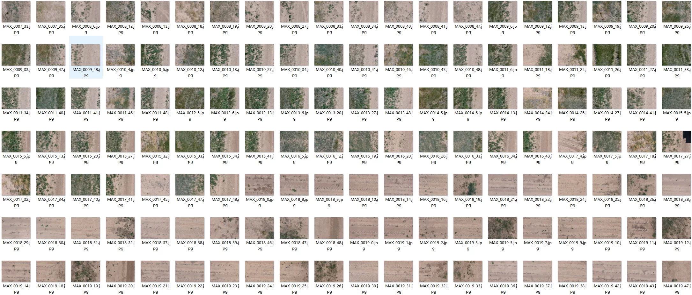
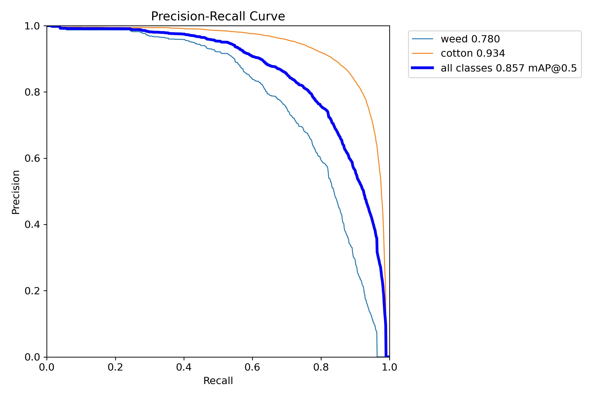
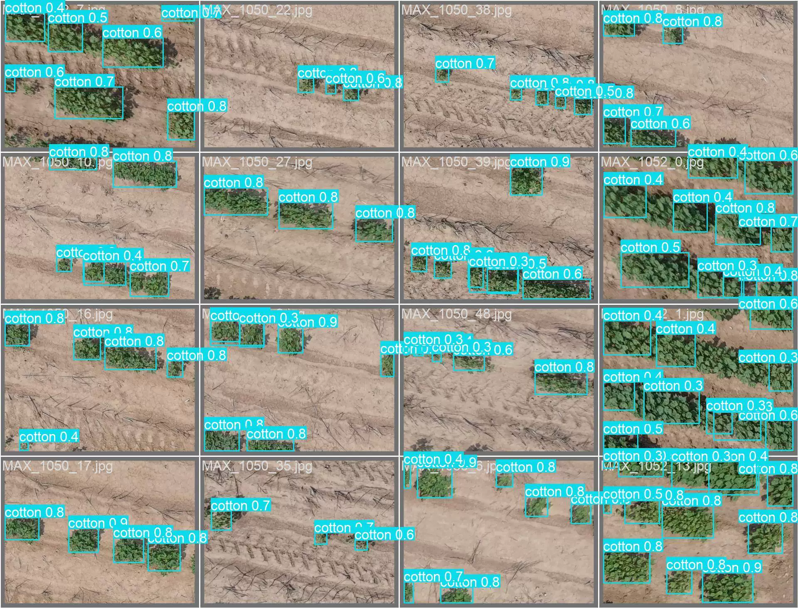
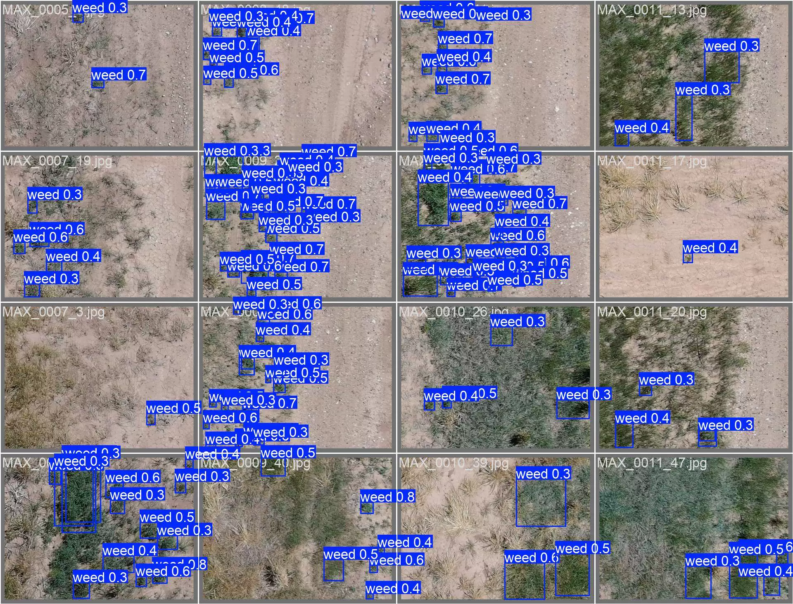
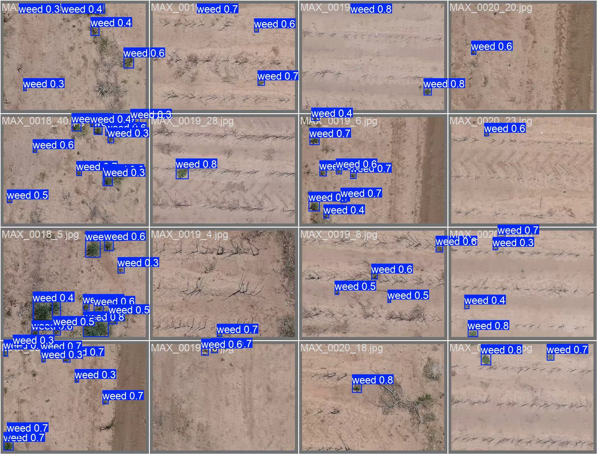
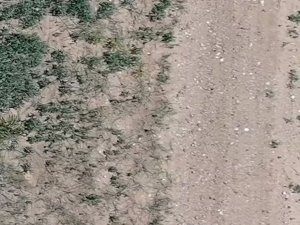
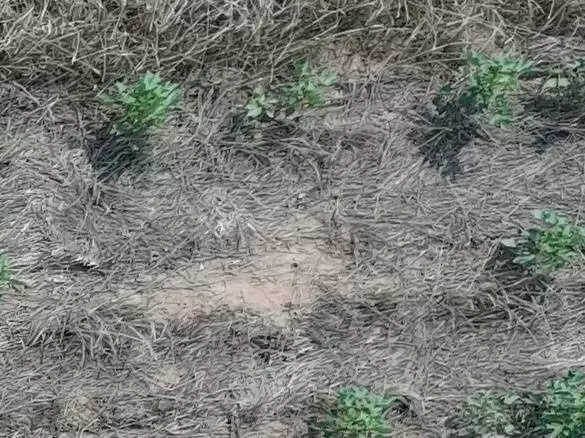

## Body

UAV Weed-Cotton Object Detection Dataset in YOLO format

Dataset Overview: UAV aerial photography dataset for detecting weeds and cotton in cotton fields.

The dataset consists of two versions, the original version without segmentation (9249 images), and the trained version with train (5876 images), val (2518 images), and test (841 images) segments.

The dataset is divided into two classes, weed and cotton.

YOLOv8s Object Detection Weights File (Training rounds 100, pre-trained model YOLOv8s.pt, mAP@0.5 0.857) with training results file

## Images

Here is a pay link on Stripe ( https://buy.stripe.com/3cs8yP7sY87d0vu9AB ). Please contact me lonlonago@foxmail.com after funding $89, and I will send you a complete data files , thank you!

